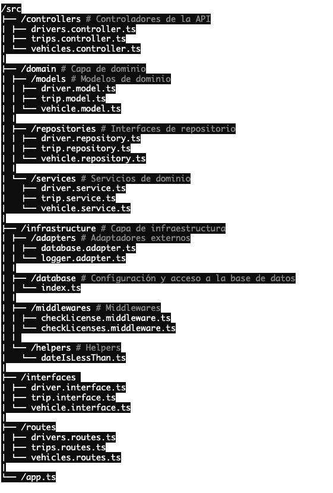
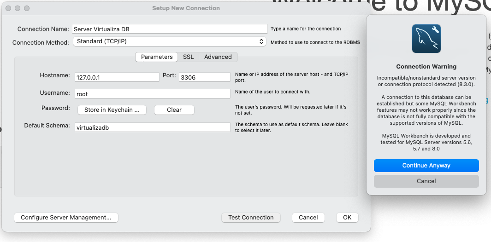
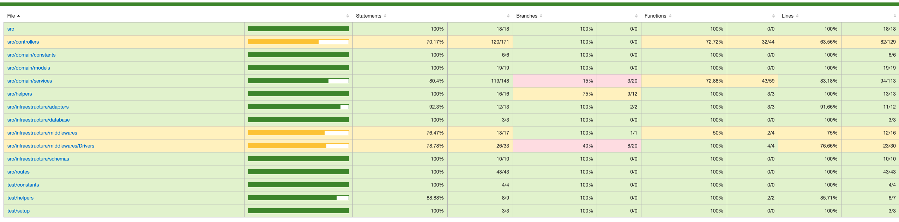

### Api Rest Virtualiza

---


## Presentación del proyecto

- Realizar un sistema de gestión para una remisería.
- La misma cuenta con una flota de vehículos (dominio, marca, modelo, kilometraje). Los mismos
  pueden estar disponibles para trabajar o en el taller.
- Asimismo, la remisería registra el precio por kilometro a pagar a sus empleados por mes (es el
  mismo para todos los empleados, cambia todos los meses).
- A su vez, los empleados (nombre, apellido, dni, tipo de licencia) pueden manejar uno o más
  vehículos. Las licencias particulares vencen cada 5 años y las profesionales son anuales.
- Debe considerar que si tiene la licencia vencida el chofer no estará disponible para manejar
  -El sistema debe registrar la cantidad de kilómetros recorridos de cada chofer por mes y el
  kilometraje del vehículo.
- El sistema debe mostrar el sueldo a liquidar por mes de cada empleado.
- Por último, los vehículos cada 15000km deben realizar el servicio y concurrir al taller.
- Mostrar listado de:
  - Kilómetros por vehículo/chofer mensual.
  - Kilómetros por vehículo mensual.
  - Ranking de choferes más rentables por mes
  - Choferes con licencia vencida.
  - Vehículos en taller.

## Idea inicial para el modelado de datos


## Tecnologías utilizadas

> [!NOTE]
>
> - Node v20.3.1
> - Typescript v5.4.5
> - Express JS v4.19.2
> - ts-node-dev
> - mysql2: v3.9.7
> - sequelize: v6.37.3
> - npx license mit
> - cors
> - dotenv
> - zod
> - jest
> - supertest

---

## Estructura base del proyecto



## Iniciar el proyecto

- Primero iniciemos el servicio de docker compose para tener accesible la BD
- Tenga en cuenta que debera crear el archivo .env.dev

```bash
PORT=3000
DB_NAME="virtualizadb"
DB_USER_ROOT="root"
DB_PASSWORD="myrootpassword"
DB_HOST="localhost"
```

```bash
docker-compose --env-file .env.dev up -d
```

- En este punto puede conectarse mediante aalgun servicio como MySQL Workbench



- Ahora pongamos a correr la api

```bash
    npm install && npm run dev
```

## Correr la suite de test

- Cree un archivo .env.test e inicie con el comando

```bash
docker-compose --env-file .env.test up -d
```

- Corra los test con

```bash
    npm run test
    npm run test:coverage  #para generar la cobertura gráfica
```



## Endpoints que soporta la api rest

Aunque hay excepciones para cada uno, esta lista resume cuándo deberías usar cada uno la mayoría de las veces.

| Drivers /drivers | descripción                    | filters(\_offset, \_limit) |
| ---------------- | ------------------------------ | -------------------------- |
| - GET            |                                |                            |
| /                | Listado                        | ✅                         |
| /:id             | Busqueda por ID                | ⛔                         |
| /top-ranking     | Choferes mas rentables         | ✅                         |
| /unable-to-drive | Choferes con licencia venciada | ✅                         |
|                  |                                |                            |
| - POST           |                                |                            |
| /                | Creación                       | ⛔                         |
|                  |                                |                            |
| - PUT            | ⛔                             |                            |
| /:id             | Actualización                  | ⛔                         |
|                  |                                |                            |
| - DELETE         | ⛔                             |                            |
| /:id             | Anulación                      | ⛔                         |

| Vehicles /vehicles  | descripción                                 | filters(\_offset, \_limit) |
| ------------------- | ------------------------------------------- | -------------------------- |
| - GET               |                                             |                            |
| /                   | Listado                                     | ✅                         |
| /:id                | Busqueda por ID                             | ⛔                         |
| /kms-driven-monthly | Kms acumulado mensual                       | ✅                         |
| /in-services        | Vehiculos en taller                         | ✅                         |
|                     |                                             |                            |
| - POST              |                                             |                            |
| /                   | Creación                                    | ⛔                         |
| /:id/ready          | resetea el contador de kms para el services | ⛔                         |
|                     |                                             |                            |
| - PUT               | ⛔                                          |                            |
| /:id                | Actualización                               | ⛔                         |
|                     |                                             |                            |
| - DELETE            | ⛔                                          |                            |
| /:id                | Anulación                                   | ⛔                         |

| Trips /trips        | descripción                                 | filters(\_offset, \_limit) |
| ------------------- | ------------------------------------------- | -------------------------- |
| - GET               |                                             |                            |
| /                   | Listado                                     | ✅                         |
| /monthly-summary    | Resumen mensual                             | ✅                         |
| /:id                | Busqueda por ID                             | ⛔                         |
| /:id/driver/vehicle | Busqueda con población de datos             | ✅                         |
|                     |                                             |                            |
| - POST              |                                             |                            |
| /                   | Creación                                    | ⛔                         |
| /:id/ready          | resetea el contador de kms para el services | ⛔                         |
|                     |                                             |                            |
| - PUT               | ⛔                                          |                            |
| /:id                | Actualización                               | ⛔                         |
|                     |                                             |                            |
| - DELETE            | ⛔                                          |                            |
| /:id                | Anulación                                   | ⛔                         |
